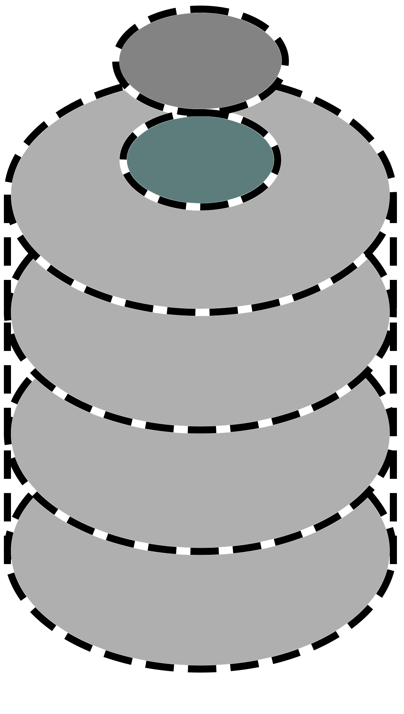

# Dedicated Extendible Server (DESrv or DES) v2.0 

[](https://github.com/Blusutils/DESrv/stargazers)
[](https://github.com/Blusutils/DESrv/network/members)
[](https://github.com/Blusutils/DESrv/releases)
[](https://github.com/Blusutils/DESrv/issues)
[](https://github.com/Blusutils/DESrv/pulls)
[](https://github.com/Blusutils/DESrv/blob/master/LICENSE.txt)

The 2.0 update branch.

## Install
For 2.0 branch installation is available only from sources.

0. Prerequesties:

* An OS - either Linux or Windows
* Visual Studio 2022 (17) (optional)
* .NET SDK 7.0 or above
* Git (any version)
* Extensions what you'll test
* (optional) Internet connection
* (optional) Connection client

1. Clone this repository:

    ```batch
    git clone https://github.com/Blusutils/DESrv.git
    ```

2. Switch to 2.0 branch:

    ```batch
    git switch desrv2.0
    ```

3. Run:

    ```batch
    :: or build solution directly from VS
    dotnet restore
    dotnet run -c Debug
    :: or: dotnet build -c Debug
    ```

## Contributing

See [CONTRIBUTING](./CONTRIBUTING.md) for more info.
